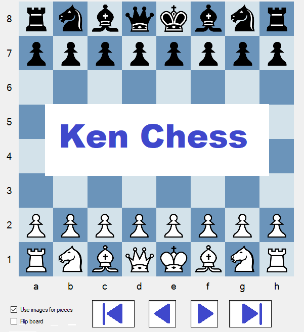

# KenChess
**Clarify what this doesn't do!**
1. KenChess does not currently support playing a game against the computer.

**Current capabilities:**
1. Programming learning tool (view code to see how to create a chess GUI to view/create games).
2. View chess games (and edit them and store them).
3. Create training games (games defining moves (and variations) you want to memorize).
4. Start a training session (using training games you created).
5. Five projects exist in the solution; a couple projects could be reused for similar solutions.

## Design Points
A chess game is represented as raw ASCII text formatted per PGN standards. 
A raw ASCII PGN game is composed of two sections. The first is the tag pair section and the second is the movetext section. 
KenChess uses a C# class, GameRepresentation, as an equivalent representation of a PGN chess game. 

    /// 

    /// CONSTRUCTOR: Create GameRepresentation from a specific game number of rawPGNMultigameASCIItext.
    /// For rawPGNSingleGameASCIItext simply use that text with gameNumber=1.
    /// 

    public GameRepresentation(string rawPGNMultigameASCIItext, int gameNumber)
    ...

